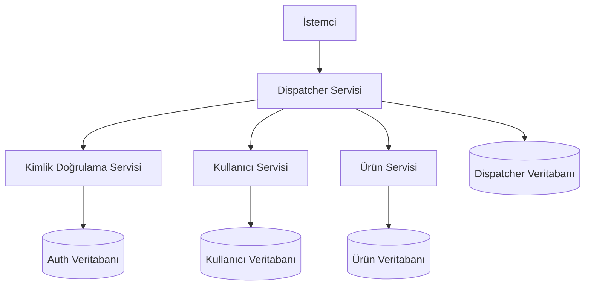
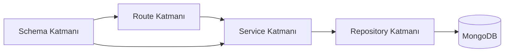
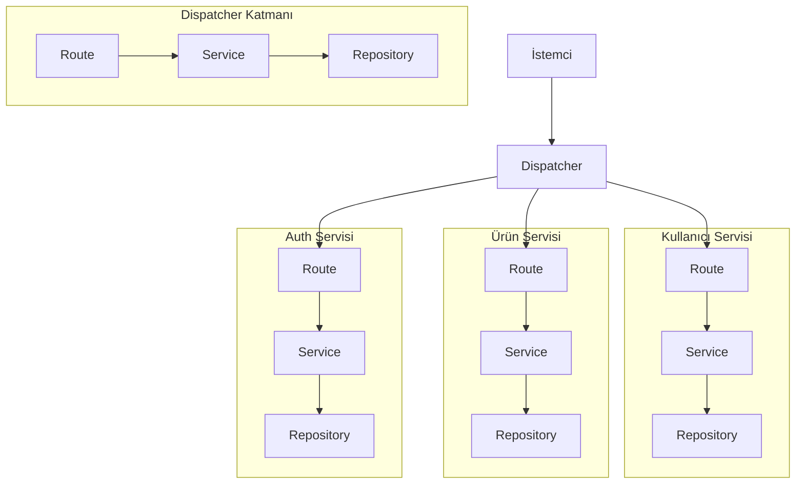
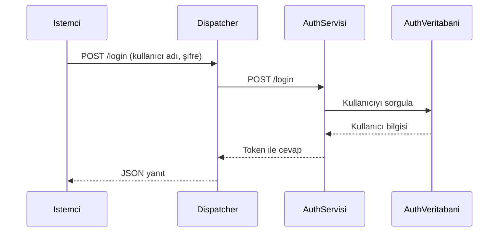
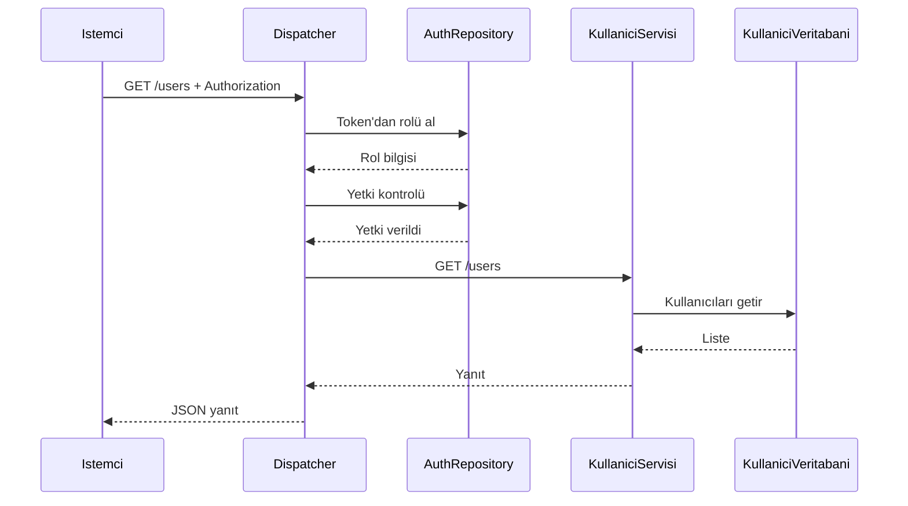
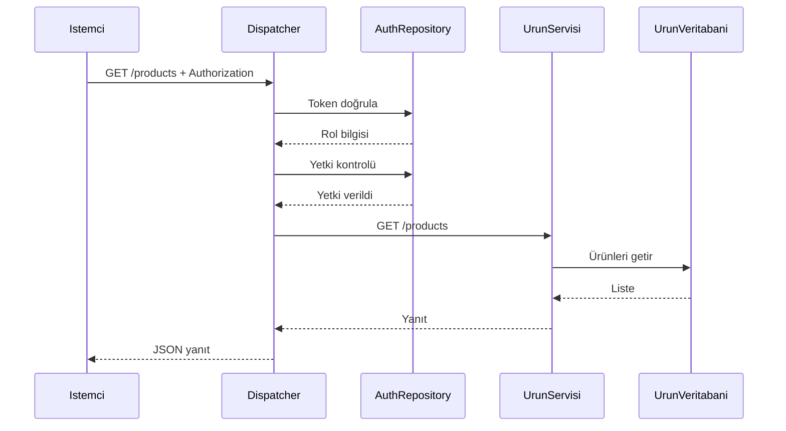
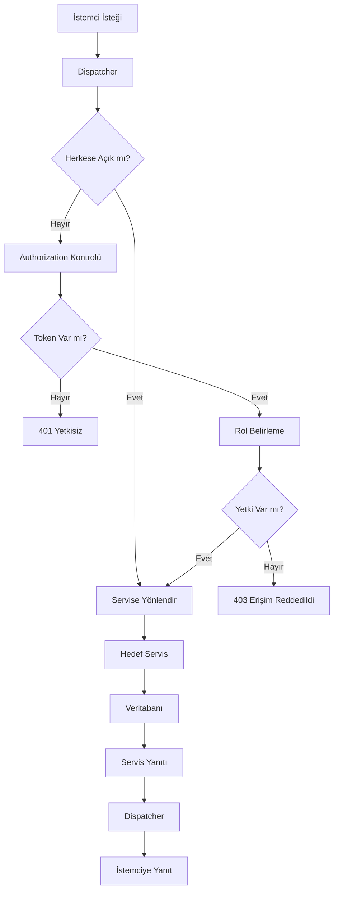

 ### Mikroservis Tabanlı E-Ticaret Yönetim Sistemi 

**Kocaeli Üniversitesi**  
**Teknoloji Fakültesi - Bilişim Sistemleri Mühendisliği**  
**Yazılım Geliştirme Laboratuvarı II | Proje 1**

---

## Proje Bilgileri

**Proje Adı:** Mikroservis Tabanlı E-Ticaret Yönetim Sistemi  
**Ders:** Yazılım Geliştirme Laboratuvarı II  
**Akademik Yıl:** 2025 – 2026  

## Ekip Üyeleri

| Ad Soyad       | Öğrenci No |
|---------------|-----------|
| Şenay Cengiz  | 231307027 |
| Yasemin Atiş  | 231307023 |

## Tarih
- Mart 2026

## Giriş

Günümüzde e-ticaret sistemleri, artan kullanıcı sayısı ve işlem yoğunluğu nedeniyle yüksek performans, ölçeklenebilirlik ve sürdürülebilirlik gerektirmektedir. Geleneksel monolitik yazılım mimarileri, bu gereksinimleri karşılamakta yetersiz kalabilmekte ve sistemin yönetimini zorlaştırmaktadır. Özellikle sistem büyüdükçe bakım, geliştirme ve hata yönetimi süreçleri karmaşık hale gelmektedir.

Bu problemleri çözmek amacıyla mikroservis mimarisi ön plana çıkmaktadır. Mikroservis yaklaşımı, uygulamaların küçük ve bağımsız servislere ayrılmasını sağlayarak her bir bileşenin ayrı ayrı geliştirilmesine, dağıtılmasına ve yönetilmesine olanak tanır. Bu sayede sistem daha esnek, modüler ve ölçeklenebilir bir yapıya kavuşur.

Bu projede, mikroservis mimarisi kullanılarak bir e-ticaret yönetim sistemi geliştirilmiştir. Sistem; kullanıcı yönetimi, ürün yönetimi ve kimlik doğrulama işlemlerini ayrı servisler üzerinden gerçekleştirmektedir. Tüm istemci istekleri, merkezi bir Dispatcher (API Gateway) üzerinden yönlendirilerek servisler arası iletişim kontrol altına alınmıştır.

Projenin temel amacı; modern yazılım geliştirme yaklaşımlarına uygun, ölçeklenebilir, yönetilebilir ve güvenli bir e-ticaret sistemi tasarlamak ve geliştirmektir. Bu doğrultuda RESTful servis prensipleri uygulanmış ve servisler arası iletişim standart HTTP metodları üzerinden sağlanmıştır.

## Amaç ve Kapsam

Bu projenin temel amacı, mikroservis mimarisi kullanılarak ölçeklenebilir ve yönetilebilir bir e-ticaret yönetim sistemi geliştirmektir. Bu doğrultuda sistem, farklı işlevlerin birbirinden bağımsız servisler olarak tasarlanması prensibine dayanmaktadır.

Proje kapsamında:

- Kullanıcı yönetimi (ekleme, listeleme, güncelleme, silme)
- Ürün yönetimi (ekleme, listeleme, güncelleme, silme)
- Kimlik doğrulama ve yetkilendirme işlemleri
- İsteklerin Dispatcher (API Gateway) üzerinden yönlendirilmesi
- Servisler arası iletişimin RESTful prensiplere uygun şekilde sağlanması

gerçekleştirilmiştir.

Bu kapsamda geliştirilen sistem, hem akademik hem de gerçek dünya uygulamalarına uygun bir mikroservis mimarisi örneği sunmaktadır.

## 3. Tasarım, Mikroservis Mimarisi, Richardson Olgunluk Modeli, RESTful Servisler, Sınıf Yapıları ve Sequence Diyagramları

### 3.1. Gerçeklenen Tasarım

Bu projede e-ticaret temelli bir sistem, mikroservis mimarisi esas alınarak geliştirilmiştir. Sistem tek parça bir uygulama yerine, belirli sorumlulukları üstlenen bağımsız servislerden oluşturulmuştur. İstemciden gelen tüm dış istekler, merkezi bir Dispatcher servisi üzerinden alınmakta ve uygun mikroservise yönlendirilmektedir.

Projede yer alan temel bileşenler şunlardır:

- Dispatcher Service
- Auth Service
- User Service
- Product Service
- Her servis için ayrı MongoDB veritabanı

`docker-compose.yml` dosyasına göre tüm servisler `microservice-net` ağı üzerinde haberleşmektedir. Dış dünyaya yalnızca `dispatcher` servisi `8000` portu üzerinden açılmıştır. `auth-service`, `user-service` ve `product-service` servisleri ise yalnızca iç ağda çalışacak şekilde yapılandırılmıştır. Böylece sistem daha güvenli, kontrollü ve yönetilebilir hale getirilmiştir.

### 3.2. Mikroservis Mimarisi

Mikroservis mimarisi, bir yazılım sisteminin tek ve büyük bir yapı yerine küçük, bağımsız ve belirli sorumluluklara sahip servisler halinde geliştirilmesini sağlayan bir yaklaşımdır. Her servis kendi iş alanına odaklanır ve diğer servislerle HTTP gibi hafif iletişim yöntemleri üzerinden haberleşir.

Bu projede mikroservis yaklaşımı şu şekilde uygulanmıştır:

- Auth Service kullanıcı giriş doğrulama işlemlerini yürütür.
- User Service kullanıcı verileri üzerindeki CRUD işlemlerini gerçekleştirir.
- Product Service ürün verileri üzerindeki CRUD işlemlerini gerçekleştirir.
- Dispatcher Service istemciden gelen istekleri karşılar, gerekli kontrolleri yapar ve isteği ilgili mikroservise yönlendirir.

Bu yapı sayesinde sistem daha modüler, geliştirilebilir ve sürdürülebilir hale gelmiştir.

### 3.3. Projede Kullanılan Mikroservislerin Görevleri

#### 3.3.1. Dispatcher Service

Dispatcher sistemin dış dünyaya açık tek giriş noktasıdır. İstemciden gelen tüm istekler önce Dispatcher’a ulaşır ve ardından ilgili servise yönlendirilir.

Dispatcher servisinin başlıca görevleri şunlardır:

- `/login` isteğini Auth Service’e yönlendirmek
- `/users` ve `/products` isteklerini ilgili servislere yönlendirmek
- Authorization başlığını kontrol etmek
- Token üzerinden rol bilgisini belirlemek
- Rol bazlı yetki kontrolü yapmak
- Hedef servise HTTP isteği göndermek
- Hedef servis hatalarını merkezi olarak yönetmek
- İstek ve yanıt bilgilerini loglamak
- `/logs` ve `/dashboard` endpointlerini sunmak

#### 3.3.2. Auth Service

Auth Service kullanıcı giriş doğrulama işlemini gerçekleştiren servistir. Kullanıcı adı ve şifre bilgisi alınır, MongoDB üzerinde kontrol edilir ve başarılı giriş durumunda kullanıcıya token döndürülür.

Projede paylaşılan koda göre:
- `admin` kullanıcısı için `admin-token`
- diğer kullanıcılar için `user-token`

üretilmektedir.

#### 3.3.3. User Service

User Service kullanıcı verilerini yöneten servistir. Bu servis üzerinde aşağıdaki işlemler gerçekleştirilmektedir:

- kullanıcı listeleme
- belirli bir kullanıcıyı getirme
- kullanıcı ekleme
- kullanıcı güncelleme
- kullanıcı silme

#### 3.3.4. Product Service

Product Service ürün verilerini yöneten servistir. Bu servis üzerinde aşağıdaki işlemler gerçekleştirilmektedir:

- ürünleri listeleme
- belirli bir ürünü getirme
- ürün ekleme
- ürün güncelleme
- ürün silme

### 3.4. RESTful Servisler

RESTful servisler, istemci ile sunucu arasında HTTP protokolü üzerinden kaynak odaklı iletişim kurulmasını sağlayan servislerdir. REST yaklaşımında veriler birer kaynak olarak değerlendirilir ve bu kaynaklara URI yapıları üzerinden erişilir.

Projede REST yaklaşımına uygun olarak aşağıdaki HTTP metodları kullanılmaktadır:

- `GET` : veri listeleme ve getirme
- `POST` : yeni veri oluşturma
- `PUT` : mevcut veriyi güncelleme
- `DELETE` : mevcut veriyi silme

Projede kullanılan başlıca endpointler şunlardır:

- `/login`
- `/users`
- `/users/{user_id}`
- `/products`
- `/products/{product_id}`
- `/logs`
- `/dashboard`

Bu yapı sayesinde servisler anlaşılır, düzenli ve standartlara uygun hale getirilmiştir.

### 3.5. Richardson Olgunluk Modeli

Richardson Olgunluk Modeli, bir web servisinin REST mimarisine ne kadar uygun geliştirildiğini değerlendirmek için kullanılan bir modeldir. Dört seviyeden oluşmaktadır.

#### Seviye 0

Tüm işlemler tek bir endpoint üzerinden yürütülür. HTTP metodları anlamlı biçimde kullanılmaz.

#### Seviye 1

Sistem kaynaklara ayrılır. Örneğin kullanıcılar ve ürünler için ayrı endpointler bulunur.

#### Seviye 2

Kaynaklara ek olarak HTTP metodları doğru amaçlarla kullanılır. `GET`, `POST`, `PUT` ve `DELETE` işlemleri görevlerine göre ayrılır.

#### Seviye 3

HATEOAS yaklaşımı uygulanır. Sunucu cevaplarında istemcinin bir sonraki adımda gidebileceği bağlantılar da yer alır.

### 3.6. Projenin Richardson Olgunluk Modelindeki Yeri

Bu proje Richardson Olgunluk Modeli açısından Seviye 2 düzeyindedir.

Bunun başlıca nedenleri şunlardır:

- Kaynak bazlı endpointler bulunmaktadır:
  - `/users`
  - `/products`
  - `/login`
- HTTP metodları doğru amaçlarla kullanılmaktadır:
  - `GET`
  - `POST`
  - `PUT`
  - `DELETE`
- JSON tabanlı istek ve yanıt yapısı vardır.
- Endpoint yapıları açık ve anlamlıdır.

Proje Seviye 3 değildir; çünkü yanıtlarda HATEOAS bağlantıları bulunmamaktadır.

### 3.7. Servislerin Katmanlı Yapısı ve Sınıf Organizasyonu

Projede servisler katmanlı bir yapıyla düzenlenmiştir. Klasör yapısına bakıldığında tüm servislerde benzer bir organizasyon bulunduğu görülmektedir.

Genel yapı aşağıdaki bölümlerden oluşmaktadır:

- `routes`
- `services`
- `repositories`
- `schemas`
- `db`

Bu katmanların görevleri şu şekildedir:

#### Route Katmanı

HTTP isteklerini karşılayan katmandır. Endpoint tanımları burada yer alır.

#### Service Katmanı

İş mantığını yöneten katmandır. Route ile repository arasında köprü görevi görür.

#### Repository Katmanı

MongoDB ile veri alışverişini gerçekleştiren katmandır. Veri ekleme, okuma, güncelleme ve silme işlemleri burada yapılır.

#### Schema Katmanı

Pydantic modellerinin tanımlandığı katmandır. Gelen istek ve dönen yanıtların veri yapısı burada belirlenir.

#### DB Katmanı

MongoDB bağlantısının kurulduğu ve yönetildiği katmandır.

Bu yapı sayesinde kod daha düzenli, okunabilir ve sürdürülebilir hale gelmiştir.

### 3.8. Dispatcher Servisinin Çalışma Mantığı

Dispatcher servisinin ana akışı `main.py` dosyasında tanımlanmıştır. Paylaşılan koda göre Dispatcher içinde aşağıdaki önemli yapılar bulunmaktadır:

- `LoginRequest`
- `PUBLIC_PATHS`
- `get_auth_repository()`
- `get_user_role(request)`
- `check_role_permission(role, path)`
- `forward_request(service, path, method, data)`
- `log_requests` middleware

Dispatcher’ın çalışma mantığı şu şekildedir:

1. İstemciden gelen istek Dispatcher’a ulaşır.
2. İstek public endpoint değilse Authorization başlığı kontrol edilir.
3. Token bilgisine göre kullanıcının rolü belirlenir.
4. İlgili endpoint için yetki kontrolü yapılır.
5. `ROUTE_MAP` üzerinden hedef servis adresi bulunur.
6. İstek ilgili mikroservise yönlendirilir.
7. Gelen cevap istemciye döndürülür.
8. İstek ve cevap bilgileri loglanır.

Dispatcher içinde ayrıca:
- `/logs`
- `/dashboard`
- bilinmeyen path’ler için `catch_all`

tanımları da bulunmaktadır.

### 3.9. Auth Service Yapısı

Auth Service içinde aşağıdaki temel bileşenler bulunmaktadır:

- `routes/auth_routes.py`
- `services/auth_service.py`
- `repositories/auth_repository.py`
- `schemas/auth_schema.py`
- `db/connection.py`

Auth Service’in temel görevi kullanıcı doğrulamaktır.

Schema tarafında aşağıdaki modeller kullanılmaktadır:

- `LoginRequest`
- `LoginData`
- `LoginResponse`

Repository tarafında `AuthRepository` sınıfı MongoDB üzerinde `users` koleksiyonu ile çalışmaktadır. Ayrıca başlangıç kullanıcılarını `_seed_users()` ile veritabanına eklemektedir.

### 3.10. User Service Yapısı

User Service içinde aşağıdaki bileşenler bulunmaktadır:

- `routes/user_routes.py`
- `services/user_service.py`
- `repositories/user_repository.py`
- `schemas/user_schema.py`
- `db/connection.py`

User Service üzerinde aşağıdaki endpointler tanımlanmıştır:

- `GET /users`
- `GET /users/{user_id}`
- `POST /users`
- `PUT /users/{user_id}`
- `DELETE /users/{user_id}`

Repository tarafında `UserRepository` sınıfı kullanıcı verilerini MongoDB’de yönetmektedir. Ayrıca:
- `_migrate_legacy_users()`
- `_seed_users()`

fonksiyonları ile eski kayıtların uyarlanması ve başlangıç verilerinin eklenmesi sağlanmaktadır.

### 3.11. Product Service Yapısı

Product Service içinde aşağıdaki bileşenler bulunmaktadır:

- `routes/product_routes.py`
- `services/product_service.py`
- `repositories/product_repository.py`
- `schemas/product_schema.py`
- `db/connection.py`

Product Service üzerinde aşağıdaki endpointler tanımlanmıştır:

- `GET /products`
- `GET /products/{product_id}`
- `POST /products`
- `PUT /products/{product_id}`
- `DELETE /products/{product_id}`

Repository tarafında `ProductRepository` sınıfı MongoDB’de ürün verilerini yönetmektedir. `_seed_products()` fonksiyonu ile başlangıç ürünleri sisteme eklenmektedir.

### 3.12. Servisler Arası Haberleşme Yapısı

Projede istemci doğrudan Auth Service, User Service veya Product Service ile haberleşmemektedir. İstemci yalnızca Dispatcher’a istek göndermektedir.

`docker-compose.yml` dosyasına göre sistemin haberleşme yapısı şu şekildedir:

- Dispatcher dış dünyaya `8000` portundan açılmıştır.
- Auth Service, User Service ve Product Service yalnızca iç ağda çalışmaktadır.
- Her servis kendi MongoDB veritabanı ile haberleşmektedir.
- Tüm servisler `microservice-net` ağı üzerinde yer almaktadır.

Bu yaklaşım, servislerin doğrudan dış erişime açılmasını engelleyerek daha kontrollü bir mimari sunmaktadır.

### 3.13. Sistem Bileşenleri Diyagramı

### 3.14. Katmanlı Mimari Diyagramı

### 3.15. Modül ve Katman İlişkisi

### 3.16. Giriş (Login) İşlemi Sequence Diyagramı

### 3.17. Kullanıcı Listeleme Sequence Diyagramı

### 3.18. Ürün Listeleme Sequence Diyagramı

### 3.19. Genel İstek Akış Diyagramı

### 3.20. Algoritma ve Çalışma Mantığı Değerlendirmesi

Projede klasik anlamda karmaşık matematiksel algoritmalar yerine, istek yönlendirme, kimlik doğrulama, yetki kontrolü ve CRUD işlemleri üzerine kurulu bir yapı bulunmaktadır. Buna rağmen sistemin temel çalışma mantığı ve performansı açısından bir değerlendirme yapılabilir.

#### İstek Yönlendirme (Dispatcher)

Dispatcher servisinde gelen istekler, `ROUTE_MAP` yapısı kullanılarak ilgili mikroservise yönlendirilmektedir. Bu yapı bir sözlük (dictionary) olduğu için anahtar üzerinden erişim sabit zamanda gerçekleşmektedir.

- Zaman karmaşıklığı: `O(1)`

#### Kimlik Doğrulama ve Yetki Kontrolü

Dispatcher içinde `get_user_role()` ve `check_role_permission()` fonksiyonları kullanılarak token doğrulama ve rol bazlı yetki kontrolü yapılmaktadır. Bu işlemler sabit büyüklükte veri üzerinde gerçekleştirildiği için:

- Zaman karmaşıklığı: `O(1)`

#### CRUD İşlemleri

User ve Product servislerinde gerçekleştirilen işlemler MongoDB üzerinde yapılmaktadır.

- Tüm verilerin listelenmesi:
  - Zaman karmaşıklığı: `O(n)`
- Tek kayıt getirme, güncelleme ve silme işlemleri:
  - Ortalama durumda hızlı çalışmaktadır (veri indeksleme durumuna bağlıdır)

Burada `n`, veri sayısını ifade etmektedir.

#### Hata Yönetimi

Dispatcher içinde `forward_request()` fonksiyonu ile servis çağrıları yapılmakta ve olası hatalar merkezi olarak yakalanmaktadır:

- Servis kapalıysa → `503 (Service Unavailable)`
- Geçersiz cevap alınırsa → `502 (Bad Gateway)`

Bu yapı sayesinde hata yönetimi sistem genelinde standart ve tutarlı hale getirilmiştir.

#### Genel Değerlendirme

Sistem, düşük zaman karmaşıklığına sahip, hızlı ve okunabilir bir yapıya sahiptir. Mikroservis mimarisi sayesinde işlemler farklı servislere dağıtılmış ve Dispatcher üzerinden merkezi kontrol sağlanmıştır. Bu yaklaşım, sistemin hem performansını hem de sürdürülebilirliğini artırmaktadır.

### 3.21. Test Yapısı ve TDD Yaklaşımı

Projede sistemin doğruluğunu ve performansını değerlendirmek amacıyla hem birim testler hem de yük testleri gerçekleştirilmiştir.

Dispatcher servisi için temel davranışların doğrulanması amacıyla `pytest` ve `FastAPI TestClient` kullanılarak testler yazılmıştır. Bu testler sayesinde yönlendirme, hata yönetimi ve yetkilendirme mekanizmalarının doğru çalıştığı kontrol edilmiştir.

Buna ek olarak sistemin performansını değerlendirmek için **Locust** aracı kullanılarak yük testleri gerçekleştirilmiştir. Locust ile farklı sayıda eş zamanlı kullanıcı senaryoları oluşturulmuş ve sistemin yoğun istek altında nasıl davrandığı gözlemlenmiştir.

Yük testleri kapsamında:

- `/login`, `/users` ve `/products` endpointleri test edilmiştir
- 50, 100 ve 200 eş zamanlı kullanıcı senaryoları uygulanmıştır
- Response time (yanıt süresi) ölçülmüştür
- Hata oranları analiz edilmiştir

Bu testler sayesinde sistemin yüksek yük altında kararlı çalıştığı ve Dispatcher üzerinden yapılan yönlendirme işlemlerinin performans açısından uygun olduğu gözlemlenmiştir.

Testlerde ayrıca servislerin doğrudan çağrılması yerine Dispatcher üzerinden erişim sağlanarak gerçek sistem akışı simüle edilmiştir.

Bu yaklaşım, Test-Driven Development (TDD) anlayışıyla uyumludur. Çünkü sistemin beklenen davranışları önceden tanımlanmış ve bu davranışların hem fonksiyonel hem de performans açısından doğru çalıştığı doğrulanmıştır.

Genel olarak test süreci, sistemin doğruluğunu, güvenilirliğini ve performansını değerlendirmek açısından önemli bir rol oynamıştır.

### 3.22. Literatür İncelemesi

Günümüzde yazılım sistemlerinin karmaşıklığının artmasıyla birlikte, geleneksel monolitik mimariler yerini daha esnek ve ölçeklenebilir yaklaşımlara bırakmıştır. Bu bağlamda mikroservis mimarisi, modern yazılım geliştirme süreçlerinde yaygın olarak tercih edilen bir yöntem haline gelmiştir.

Mikroservis mimarisi; uygulamanın küçük, bağımsız ve belirli sorumluluklara sahip servislere bölünmesini temel alır. Bu yaklaşım sayesinde her servis bağımsız olarak geliştirilebilir, dağıtılabilir ve ölçeklenebilir. Ayrıca bir serviste oluşan hatanın tüm sistemi etkilememesi, bu mimarinin en önemli avantajlarından biridir. Bu projede de Auth, User ve Product servislerinin ayrı ayrı tasarlanması bu yaklaşımın bir yansımasıdır.

REST (Representational State Transfer) mimarisi, istemci ve sunucu arasında standart HTTP protokolleri üzerinden iletişim kurulmasını sağlayan bir yaklaşımdır. RESTful servisler, kaynak odaklı yapı ve HTTP metodlarının doğru kullanımı ile sade ve anlaşılır API tasarımları sunar. Bu projede kullanılan `/users`, `/products` ve `/login` gibi endpointler, REST prensiplerine uygun şekilde tasarlanmıştır.

Richardson Olgunluk Modeli (RMM), REST servislerin olgunluk seviyesini değerlendirmek için kullanılan bir modeldir. Bu model, servislerin yalnızca çalışıyor olmasını değil, aynı zamanda doğru HTTP metodlarının kullanılmasını ve kaynak temelli tasarımın uygulanmasını da dikkate alır. Bu projede kaynak bazlı endpoint yapısı ve HTTP metodlarının doğru kullanımı sayesinde sistemin Seviye 2 düzeyinde olduğu görülmektedir.

Mikroservis mimarisinde yaygın olarak kullanılan bir diğer önemli yapı ise API Gateway (Dispatcher) yaklaşımıdır. API Gateway, istemci ile mikroservisler arasında bir katman oluşturarak tüm isteklerin tek bir noktadan yönetilmesini sağlar. Bu sayede güvenlik, yönlendirme, loglama ve hata yönetimi merkezi olarak kontrol edilebilir. Bu projede Dispatcher servisinin kullanılması, bu yaklaşımın doğrudan uygulanmış bir örneğidir.

Sonuç olarak bu projede, mikroservis mimarisi, RESTful servis tasarımı ve API Gateway yaklaşımı birlikte kullanılarak modern yazılım geliştirme prensiplerine uygun bir sistem geliştirilmiştir. Bu yapı, literatürde önerilen ölçeklenebilir, sürdürülebilir ve modüler sistem tasarımı yaklaşımları ile uyumludur.

#### Kullanılan Kaynaklar

- Newman, S. (2015). *Building Microservices*. O'Reilly Media.
- Fielding, R. T. (2000). *Architectural Styles and the Design of Network-based Software Architectures* (REST).
- Richardson, L. (2008). *RESTful Web Services*. O'Reilly Media.

### 3.23. Bu Bölümün Genel Değerlendirmesi

Bu bölümde geliştirilen sistemin mimari yapısı detaylı olarak incelenmiş ve mikroservis yaklaşımına uygun şekilde tasarlandığı gösterilmiştir. Her bir servis belirli bir sorumluluğu üstlenecek şekilde ayrılmış, Dispatcher (API Gateway) üzerinden merkezi yönlendirme ve kontrol sağlanmıştır. Bu sayede sistem hem modüler hem de yönetilebilir bir yapıya kavuşmuştur.

Projede RESTful servis prensipleri uygulanmış, kaynak bazlı endpoint yapısı ve HTTP metodlarının doğru kullanımı ile sistem Richardson Olgunluk Modeli’nin 2. seviyesine ulaşmıştır. Ayrıca katmanlı mimari sayesinde kod organizasyonu düzenli hale getirilmiş, servisler arası bağımlılık azaltılmıştır.

Mermaid diyagramları ile sistemin akışları, servisler arası iletişim ve iç yapı görsel olarak ifade edilmiş; bu sayede sistemin çalışma mantığı daha anlaşılır hale getirilmiştir. Yapılan testler ve yük testleri ile sistemin hem doğruluğu hem de performansı değerlendirilmiş, Dispatcher üzerinden yürütülen merkezi kontrol mekanizmasının doğru çalıştığı doğrulanmıştır.

Sonuç olarak geliştirilen sistem, mikroservis mimarisi, RESTful tasarım prensipleri ve API Gateway yaklaşımını başarılı şekilde bir araya getiren, ölçeklenebilir ve sürdürülebilir bir yazılım çözümü sunmaktadır.

## 4. Sistem Yapısı ve Modüller

Bu bölümde geliştirilen mikroservis tabanlı e-ticaret sisteminin genel yapısı ve modülleri üst düzeyde gösterilmiş, her modülün sistem içindeki görevi açıklanmıştır. Bu bölüm, bir önceki bölümde ayrıntılı olarak açıklanan mimariyi daha özet ve yapısal bir bakış açısıyla sunmaktadır.

### 4.1. Genel Sistem Mimarisi

Bu mimaride istemciden gelen tüm istekler Dispatcher tarafından karşılanmakta ve ilgili mikroservise yönlendirilmektedir. Her servis kendi veritabanına sahip olacak şekilde tasarlanmıştır. Böylece servisler arası bağımsızlık artırılmış, sistemin ölçeklenebilirliği ve yönetilebilirliği güçlendirilmiştir.

### 4.2. Modüllerin Genel Görevleri

Sistemde yer alan ana modüller ve görevleri aşağıdaki gibidir:

- **Dispatcher Servisi:** İstekleri karşılar, yönlendirir, yetki kontrolü yapar ve hata yönetimini merkezi olarak yürütür.
- **Auth Servisi:** Kullanıcı doğrulama işlemlerini gerçekleştirir ve token üretir.
- **Kullanıcı Servisi:** Kullanıcı verileri üzerindeki CRUD işlemlerini yürütür.
- **Ürün Servisi:** Ürün verileri üzerindeki CRUD işlemlerini yürütür.
- **MongoDB Veritabanları:** Her servisin kendi verisini bağımsız biçimde saklamasını sağlar.

Bu modüler yapı, sistemin farklı parçalarının birbirinden bağımsız geliştirilebilmesine olanak tanımaktadır.

### 4.3. Katmanlı Servis Yapısı

Bu yapıda:

- **Route katmanı:** HTTP isteklerini karşılar
- **Service katmanı:** İş mantığını yürütür
- **Repository katmanı:** Veritabanı işlemlerini gerçekleştirir
- **Schema katmanı:** Veri modellerini tanımlar

Bu katmanlı yapı sayesinde servisler daha düzenli, okunabilir ve sürdürülebilir bir yapıya kavuşmuştur.

### 4.4. Modül İlişkileri Diyagramı

Bu diyagram, sistemdeki ana modüllerin kendi iç katmanlarıyla birlikte nasıl organize edildiğini göstermektedir. Dispatcher, istemciden gelen istekleri ilgili servislerin route katmanına yönlendirerek sistemin merkezinde yer almaktadır.

### 4.5. Genel Değerlendirme

Sistem, mikroservis mimarisi prensiplerine uygun olarak modüler biçimde tasarlanmıştır. Her servis kendi sorumluluğunu yerine getirmekte, Dispatcher üzerinden merkezi kontrol sağlanmakta ve katmanlı yapı ile kod organizasyonu güçlendirilmektedir.

Bu yapı sayesinde sistem:

- Ölçeklenebilir
- Yönetilebilir
- Bakımı kolay
- Genişletilebilir

bir hale getirilmiştir.

##  Sonuç ve Tartışma

Bu projede mikroservis mimarisi temel alınarak, Dispatcher (API Gateway) merkezli bir e-ticaret sistemi tasarlanmış ve başarıyla gerçekleştirilmiştir. Geliştirilen sistemde, servisler birbirinden bağımsız çalışacak şekilde yapılandırılmış ve tüm istekler merkezi bir Dispatcher üzerinden yönetilmiştir.

Bu yaklaşım sayesinde sistem hem daha modüler hale getirilmiş hem de ölçeklenebilir ve yönetilebilir bir yapı elde edilmiştir.

---

###  Başarılar

- Mikroservis mimarisi başarıyla uygulanmış ve servisler bağımsız şekilde yapılandırılmıştır.
- Dispatcher, sistemin tek giriş noktası olarak tüm istekleri doğru mikroservislere yönlendirmektedir.
- Yetkilendirme mekanizması merkezi olarak Dispatcher üzerinde gerçekleştirilmiştir.
- Mikroservisler dış dünyaya kapatılarak ağ izolasyonu sağlanmıştır (network isolation).
- Her mikroservis için ayrı MongoDB kullanılarak veri izolasyonu gerçekleştirilmiştir.
- RESTful API prensiplerine uygun endpoint tasarımı yapılmıştır (RMM Seviye 2).
- Dispatcher servisi Test Driven Development (TDD) yaklaşımıyla geliştirilmiştir.
- Locust kullanılarak sistem üzerinde yük testi gerçekleştirilmiş ve performans metrikleri elde edilmiştir.
- Sistem, 50, 100, 200 ve 500 eş zamanlı kullanıcı altında test edilmiş ve stabil çalıştığı gözlemlenmiştir.
- Dispatcher içerisinde geliştirilen özel loglama mekanizması sayesinde:
  - Gelen istekler (method, path, status code, timestamp)
  - Sistem davranışları kayıt altına alınmıştır.
- Monitoring için hazır araçlar yerine sistem içerisinde geliştirilen özel bir çözüm kullanılmıştır:
  - Yük testi sonuçları JSON formatında saklanmıştır (`load_test_results.json`)
  - Bu veriler dashboard arayüzü üzerinden görselleştirilmiştir
  - Trafik yoğunluğu, hata oranı ve yanıt süreleri analiz edilmiştir
- Dashboard arayüzü sayesinde:
  - Trafik analizi
  - Status code dağılımı
  - Performans metrikleri
  - Log kayıtları  
  kullanıcı dostu bir şekilde sunulmuştur.

---

### Sınırlılıklar

- Sistem gerçek üretim ortamı yerine lokal ortamda test edilmiştir.
- Kullanılan kimlik doğrulama mekanizması basit token yapısı ile sınırlıdır (JWT gibi gelişmiş çözümler kullanılmamıştır).
- Mikroservisler arası iletişim yalnızca HTTP üzerinden gerçekleştirilmiştir (asenkron iletişim kullanılmamıştır).
- Geliştirilen monitoring sistemi temel seviyede olup, Grafana ve Prometheus gibi endüstriyel araçlar entegre edilmemiştir.
- Sistem küçük ölçekli veri setleri ile test edilmiştir.
- Yük testi senaryoları belirli sınırlar içinde gerçekleştirilmiştir.

---

### Olası Geliştirmeler

- Richardson Maturity Model Seviye 3 (HATEOAS) desteği eklenebilir.
- JWT tabanlı daha güvenli kimlik doğrulama sistemi geliştirilebilir.
- Servisler arası iletişim için Kafka veya RabbitMQ gibi mesajlaşma sistemleri entegre edilebilir.
- Kubernetes kullanılarak sistem orkestrasyonu ve otomatik ölçeklenebilirlik sağlanabilir.
- Grafana ve Prometheus gibi araçlar entegre edilerek daha gelişmiş monitoring altyapısı kurulabilir.
- CI/CD pipeline (GitHub Actions vb.) eklenerek otomatik test ve deployment süreçleri oluşturulabilir.
- Daha büyük veri setleri ve gerçekçi senaryolar ile performans testleri genişletilebilir.

---

### Genel Değerlendirme

Geliştirilen sistem, mikroservis mimarisinin temel prensiplerini başarıyla yansıtmaktadır. Dispatcher üzerinden merkezi kontrol sağlanırken, servisler arası bağımsızlık korunmuştur. Bu sayede sistem hem esnek hem de ölçeklenebilir bir yapıya kavuşmuştur.

Proje sürecinde nesne yönelimli programlama, Test Driven Development (TDD), RESTful API tasarımı, Docker ile konteynerleştirme ve yük testi gibi modern yazılım geliştirme yaklaşımları bir arada kullanılmıştır.

Sonuç olarak, geliştirilen sistem akademik gereksinimleri karşılayan, pratikte uygulanabilir ve geliştirilebilir bir mikroservis mimarisi örneği sunmaktadır.
